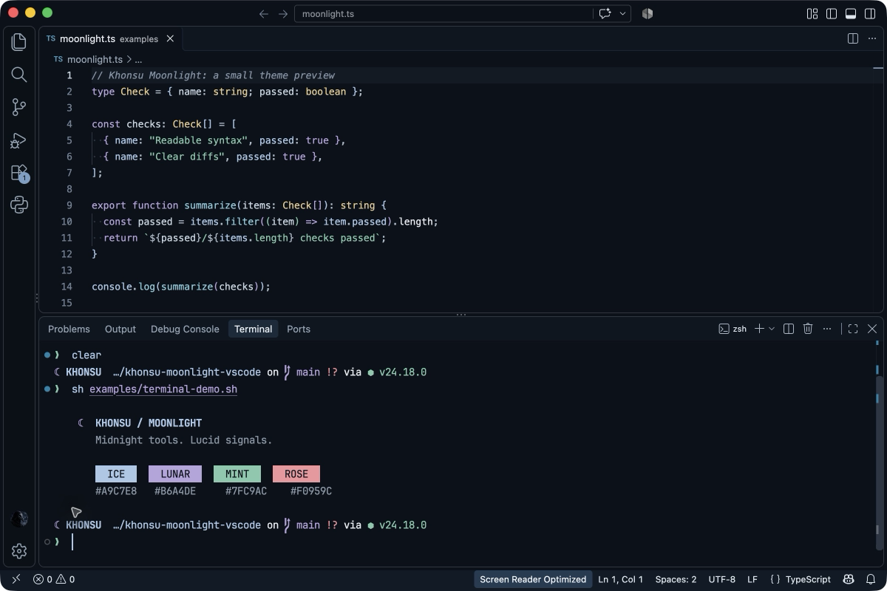
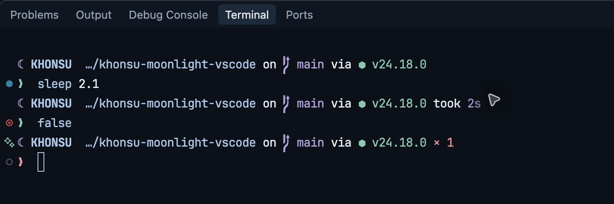
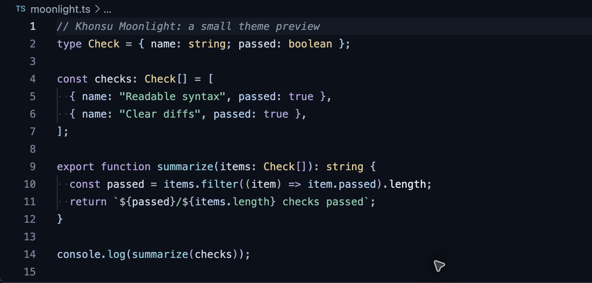
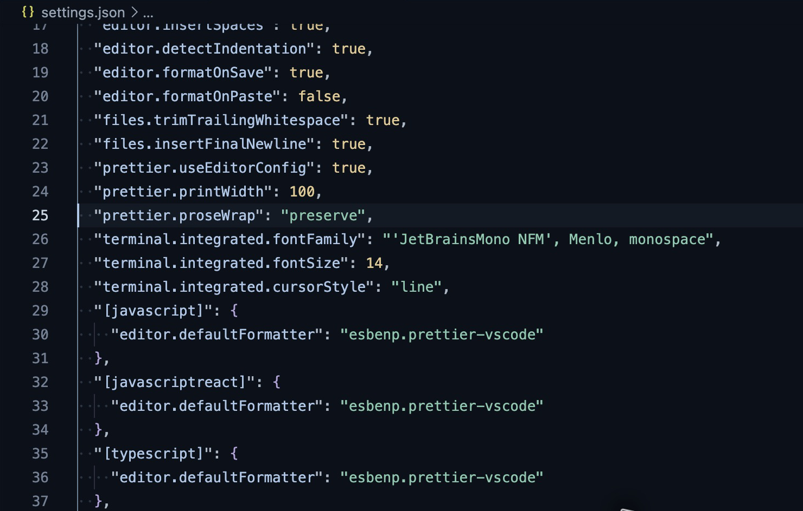
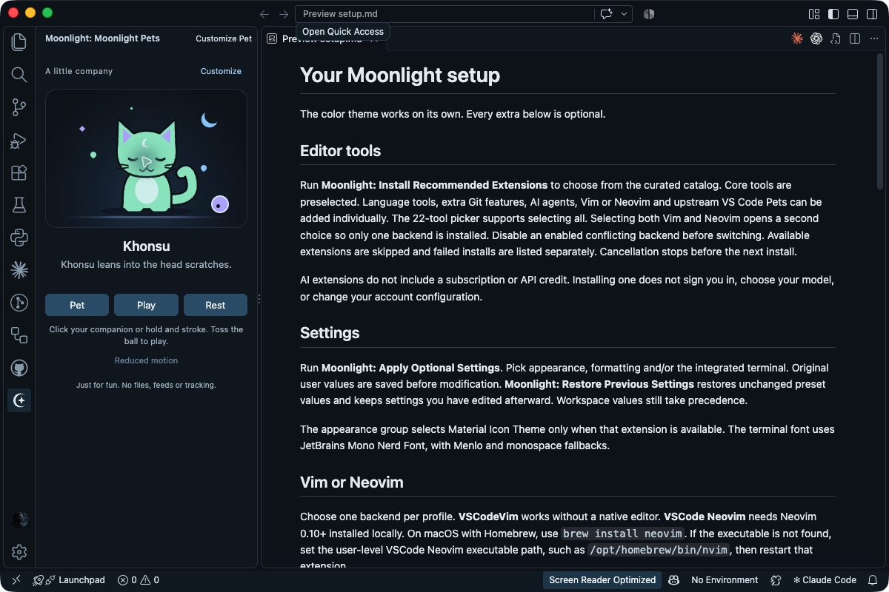
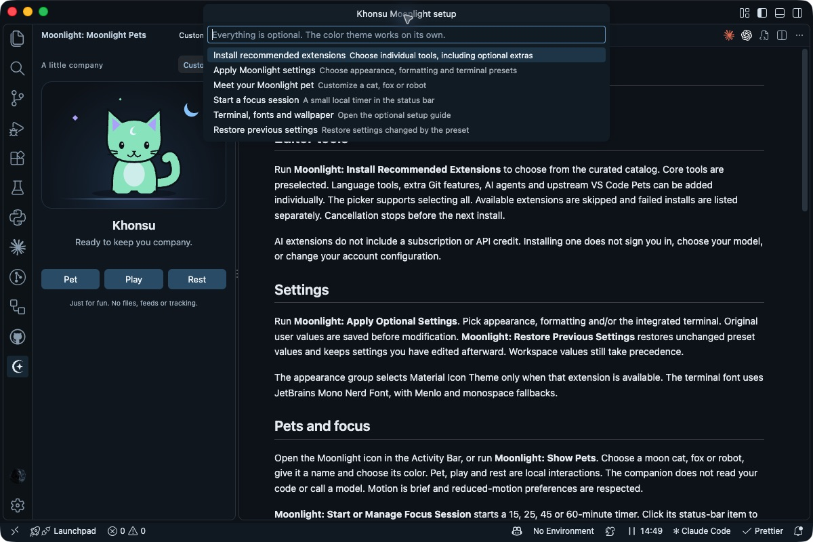
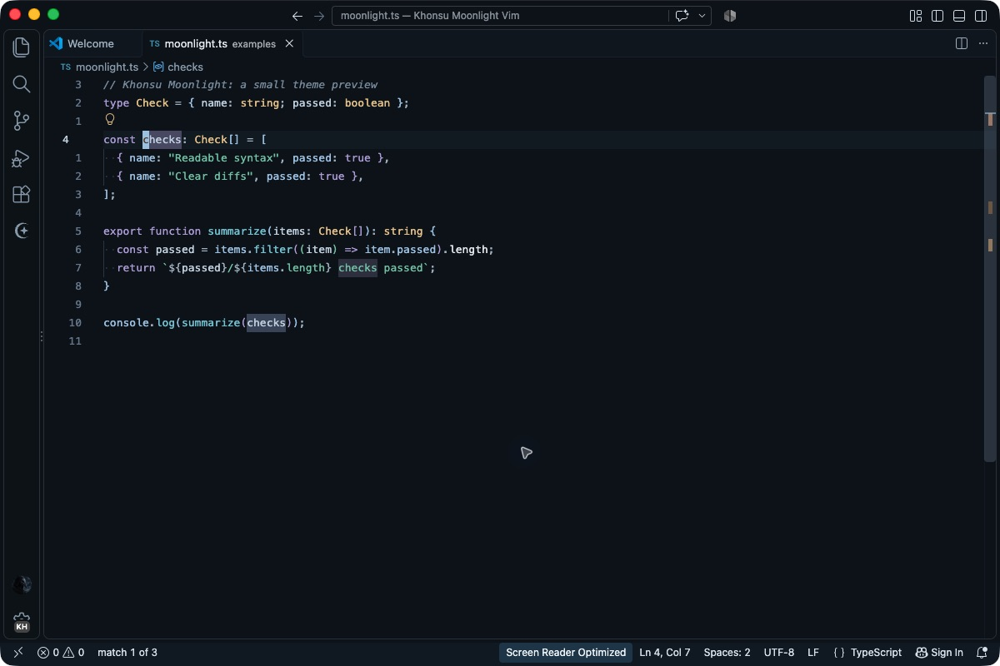
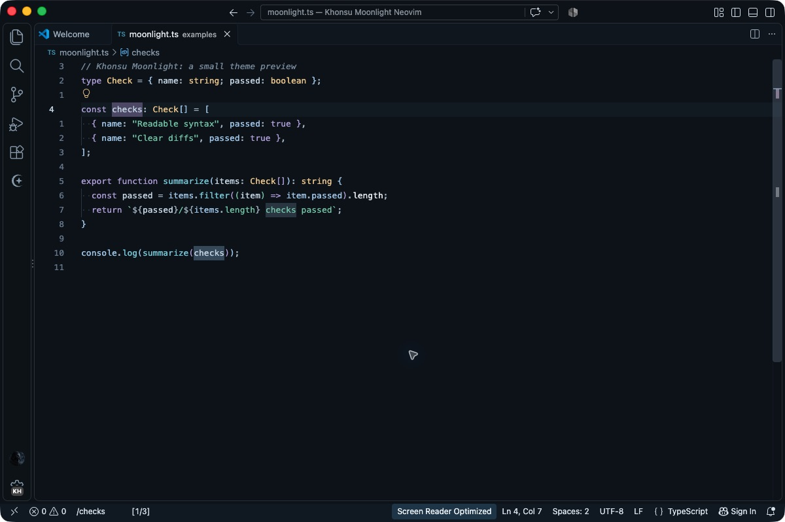
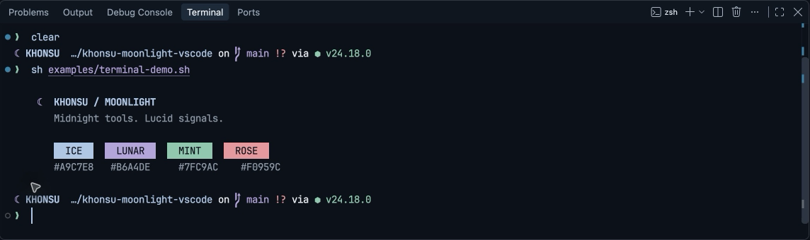

# Khonsu Moonlight


A dark Visual Studio Code color theme built around a midnight-navy editor, pale text, and a small set of cool accents. Ice blue marks focus and links, muted lavender carries language structure, mint distinguishes strings and additions, and muted rose marks removals and errors. Warm sand highlights literals and types so common syntax remains easy to scan.

The color theme works on its own. Version 0.4.0 includes optional setup commands, a curated extension installer, Vim and Neovim presets, custom companions and a focus timer. No extensions, settings or shell commands run automatically on activation. Workbench surfaces stay close to the editor background, with restrained borders and clear selection states.



## Details

Real screenshots from VS Code on macOS. Click an image to inspect it at full size.

The two-line Starship prompt shows the current Git branch and detected Node version. `sleep 2.1` demonstrates timing. The harmless `false` command demonstrates exit code 1 and the rose error prompt.

[](screenshots/prompt-details.png)

The included TypeScript sample shows the syntax colours and bracket guides. The sample text is illustrative, not a test report.

[](screenshots/syntax-details.png)

The shipped public profile uses JetBrains Mono Nerd Font at 14 px in the terminal, a line cursor and Prettier on save.

[](screenshots/settings-details.png)

## Install

Install [Khonsu Moonlight from the Visual Studio Marketplace](https://marketplace.visualstudio.com/items?itemName=khons-hu.khonsu-moonlight), or search for **Khonsu Moonlight** in VS Code's Extensions view.

```sh
code --install-extension khons-hu.khonsu-moonlight
```

Select **Khonsu Moonlight** from **Preferences: Color Theme**.

For manual installation, download the [0.4.0 VSIX](https://github.com/khons-hu/khonsu-moonlight/releases/download/v0.4.0/khonsu-moonlight-0.4.0.vsix), then run **Extensions: Install from VSIX...** and choose the file. [GitHub Releases](https://github.com/khons-hu/khonsu-moonlight/releases) include the source and release notes.

To build the current version yourself, use the VS Code Extension Manager (`vsce`) from this directory:

```sh
npx @vscode/vsce package
```

## Setup and extras

Run **Moonlight: Setup and Extras** from the Command Palette. Every part is optional:

- **Install Recommended Extensions** opens a multi-select picker with 22 tools. Choose individual tools or select all. If both modal editors are selected, a second picker asks you to choose one. An enabled conflicting backend must be disabled before installing the other. It skips tools available in the current window, installs sequentially through VS Code's Marketplace command and reports failures. Cancel to stop before the next install.
- **Apply Optional Settings** lets you choose appearance, formatting and integrated terminal groups. It backs up changed user values and merges language-specific settings. **Restore Previous Settings** keeps settings you have edited afterward. Workspace settings take precedence.
- **Show Pets** opens the Moonlight sidebar. Customize an original moon cat, fox or little robot with a name and preset or custom hex color. Pet, Play and Rest trigger short reactions. Reduced motion is respected, with no continuous animation, network requests or access to your code.
- **Start or Manage Focus Session** starts a 15, 25, 45 or 60-minute status-bar timer. Click to pause, resume or stop. It only runs after you start it and ends when the window reloads or closes.
- **Open Setup Guide** covers fonts, shell configs, a separate VS Code profile, the native Terminal preset, Codex colors and the matching desktop wallpaper.

The catalog includes the existing formatters and language tools, plus [Material Icon Theme](https://marketplace.visualstudio.com/items?itemName=PKief.material-icon-theme), [Error Lens](https://marketplace.visualstudio.com/items?itemName=usernamehw.errorlens), [markdownlint](https://marketplace.visualstudio.com/items?itemName=DavidAnson.vscode-markdownlint), [REST Client](https://marketplace.visualstudio.com/items?itemName=humao.rest-client), GitHub PR and Actions tools, Tailwind, Vitest, Jupyter and GitLens. Optional Codex and Claude Code integrations need their own account access. GitLens has some paid features. Upstream VS Code Pets is an optional extra, separate from Moonlight's own companions. [Browse the full catalog](config/extension-catalog.json).





Moonlight has no mandatory extension dependencies, telemetry, account credentials or background model calls. VS Code handles extension downloads and its normal publisher/account prompts.

## Vim and Neovim

Both modal backends are optional. Use **VSCodeVim** or **VSCode Neovim** in a profile, not both together. The generic Moonlight profile does not enable either.

- [VSCodeVim](https://github.com/VSCodeVim/Vim) provides Vim editing without a separate executable. The Moonlight preset adds relative line numbers, mode-specific cursors, lavender search highlights and an ice-blue current match. Common Ctrl shortcuts for select, copy, find, save and undo stay with VS Code. Existing unrelated key delegations are retained.
- [VSCode Neovim](https://github.com/vscode-neovim/vscode-neovim) uses a real local Neovim 0.10+ installation. Its preset uses relative line numbers and keeps Ctrl-C with VS Code in insert mode. On macOS, install Neovim with `brew install neovim`. Set the user-level executable path if VS Code cannot find it, for example `/opt/homebrew/bin/nvim` on an Apple silicon Homebrew installation.

Run **Moonlight: Configure Vim or Neovim** after enabling the chosen backend. Changed user settings are backed up for **Restore Previous Settings**. The Neovim version check runs only on this explicit command in a trusted workspace, with the user-level or default executable path. Workspace executable overrides are not executed by Moonlight. Restart VSCode Neovim after changing its executable path if needed.

For separate setups, import [`config/khonsu-moonlight-vim.code-profile`](config/khonsu-moonlight-vim.code-profile) or [`config/khonsu-moonlight-neovim.code-profile`](config/khonsu-moonlight-neovim.code-profile). Each contains the theme, its settings and only one modal backend. Use VS Code's native profile switcher to choose between them. No user Vim mappings or dotfiles are replaced by the extension. The status bar color-control feature of VSCodeVim is deliberately left off, because it writes changing colors to workspace settings.

Real VS Code profiles with the included TypeScript sample, relative line numbers and a search for `checks`:




### Native Vim and Neovim colors

The original Moonlight colorschemes also work outside VS Code, without a plugin manager or downloaded theme dependencies:

- Copy [`config/vim/colors/khonsu-moonlight.vim`](config/vim/colors/khonsu-moonlight.vim) into your Vim user runtime's `colors` directory, usually `~/.vim/colors/`. Merge the optional [`example-vimrc`](config/vim/example-vimrc) snippet into your existing vimrc, then run `:colorscheme khonsu-moonlight`.
- Copy [`config/nvim/colors/khonsu-moonlight.lua`](config/nvim/colors/khonsu-moonlight.lua) into `colors/` under `:lua print(vim.fn.stdpath("config"))`. Merge the optional [`example-init.lua`](config/nvim/example-init.lua) snippet into your existing config, then run `:colorscheme khonsu-moonlight`. Its native UI settings are guarded by `if not vim.g.vscode` for embedded sessions.

Back up any existing file before copying. The theme includes truecolor and terminal-color fallbacks, syntax, search, selection, diff and diagnostics. Neovim also includes Tree-sitter and LSP highlight groups. It does not install parsers, servers or plugins. VS Code uses the Moonlight VS Code theme for its surfaces.

## Optional editor setup

After installing the theme, run **Profiles: Import Profile** and select [`config/khonsu-moonlight.code-profile`](config/khonsu-moonlight.code-profile) to create a separate profile with the optional settings and language extensions. Install Khonsu Moonlight in that profile too. The profile contains only editor settings and a list of public extensions. It does not include account data, workspace history, MCP servers or credentials.

Alternatively, merge the preferences in [`config/settings.json`](config/settings.json) into your user settings. Review the values first, rather than replacing your existing file. [`config/extensions.json`](config/extensions.json) lists the suggested extensions. The theme works without any of them. The same optional setup files are now bundled in the extension and accessible with **Moonlight: Open Setup Assets**.

The editor uses Menlo with monospace fallbacks. The appearance preset can select Material Icon Theme when it is available. The terminal uses JetBrains Mono Nerd Font Mono (`JetBrainsMono NFM`) at 14px, with extra line spacing and a steady line cursor. The editor has no minimap, bracket guides and format on explicit save. Prettier covers web files and Markdown, Ruff formats Python and organizes imports on explicit save. ESLint, EditorConfig, YAML and Vue support are recommended. Project-specific `.prettierrc`, `.editorconfig`, Ruff and workspace settings take precedence over the personal formatting defaults. VS Code does not run format-on-save for Auto Save after a short delay, so use a normal save when you want formatting.

A matching [Codex theme import string](config/codex-theme.txt) is included. Import it under **Settings > Appearance > Dark theme > Import**. That preset was checked against the installed Codex theme format, but has not been applied or visually tested in Codex. Claude Desktop currently exposes dark mode and chat-font controls, without a custom background or palette import in the version inspected.

## Optional terminal setup

The terminal adds a lunar two-line [Starship](https://starship.rs/config/) prompt, shortened paths, Git branch and working-tree indicators, detected project runtimes, command duration after two seconds and the last command's failure code. Completions, muted autosuggestions and syntax highlighting come from the separate zsh setup. These shell files are optional and are not executed by the VS Code extension.

On macOS with Homebrew, **Moonlight: Prepare macOS Terminal Setup** prepares the bundled setup command in a terminal. Review it and press Enter to run it. The script installs the dependencies below, copies configs with timestamped backups and appends the source block to `.zshrc` once. It does not install Homebrew, use sudo or change your PATH. Alternatively, install the public dependencies manually:

```sh
brew install starship zsh-autosuggestions zsh-syntax-highlighting
brew install --cask font-jetbrains-mono-nerd-font
```

Review [`config/starship.toml`](config/starship.toml) and [`config/moonlight.zsh`](config/moonlight.zsh), then copy them to `~/.config/starship.toml` and `~/.config/moonlight/moonlight.zsh`. Back up any existing files first. Add this to your existing `~/.zshrc`:

```zsh
if [[ -r "$HOME/.config/moonlight/moonlight.zsh" ]]; then
  source "$HOME/.config/moonlight/moonlight.zsh"
fi
```

Open a new terminal session. The setup keeps your PATH, history file, history sizes and history sharing settings. It ignores duplicate history entries and commands starting with a space. Homebrew plugins load only from their conventional Apple silicon or Intel locations, and missing dependencies are skipped. Starship is skipped for `TERM=dumb`. Other platforms can use the prompt config with their own Starship installation, but the optional plugin paths are macOS-specific.

[`examples/terminal-demo.sh`](examples/terminal-demo.sh) prints a one-shot colour preview. It does not fabricate build output, change files or make network calls.

For native macOS Terminal, import [`config/Khonsu Moonlight.terminal`](config/Khonsu%20Moonlight.terminal) through **Terminal > Settings > Profiles > Action menu > Import**. It includes matching ANSI colours and the installed font. The preset passed plist validation but has not been imported or visually tested. The screenshots show VS Code's integrated terminal.



## Palette

| Role | Color |
| --- | --- |
| Midnight navy | `#0B111A` |
| Pale text | `#E8EDF2` |
| Ice blue | `#A9C7E8` |
| Muted lavender | `#B6A4DE` |
| Mint | `#7FC9AC` |
| Muted rose | `#F0959C` |

The theme targets VS Code `^1.100.0`. Syntax coloring includes common TextMate scopes and semantic tokens, with rules for JavaScript, TypeScript, Python, JSON, HTML, CSS, and Markdown. Exact coloring can vary by language extension and grammar.

## Verification

Version 0.1.0 was packaged and installed in VS Code 1.140.0 on macOS Apple silicon. The theme was visually checked on the included synthetic TypeScript sample. Prettier format-on-save was checked in VS Code, and the installed Ruff formatter normalized a synthetic Python sample from its CLI. The profile format was checked against VS Code's profile resource schema.

Version 0.2.0 adds the terminal setup. The shell files passed syntax checks, the TOML parsed successfully, and the native Terminal preset passed plist validation. Starship 1.26.0, zsh-autosuggestions 0.7.1, zsh-syntax-highlighting 0.8.0 and Nerd Fonts 3.5.1 were installed on macOS. The live integrated terminal was checked in VS Code. The Codex and native macOS Terminal presets remain manual imports, without live appearance checks.

Version 0.3.0 passed 22 runtime checks and a real VS Code 1.140.0 extension-host smoke test. Live macOS checks covered installing a selected Marketplace extension, applying backed-up appearance settings, pet customization and play, and focus start, pause, resume and stop. The screenshots above come from that installed build.

Version 0.4.0 passed 30 runtime checks, a real VS Code 1.140.0 extension-host smoke test and 35 native-editor assertions in Vim 9.1 and Neovim 0.12.5. Separate VSCodeVim and VSCode Neovim profiles were configured and checked for navigation and search in the macOS UI. The checks cover exclusive backend selection, cancellation, retained key settings, the trusted-workspace guard, supported Neovim versions, color values and terminal fallbacks.
